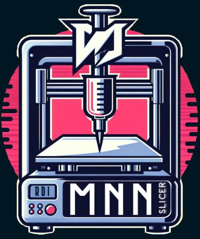

#  
 MNN-Slicer. 

# 
 Welcome to the Future of Food Printing with MNN Slicer! 

##  
 RDI Prototyping Lab, Faculty of BioTech, MSA University. 

 Authors: Mostafa Kamal Eldin, Nehal Alaa, Nancy Khalaf, Ahmed Gomaa. 

Introducing MNN Slicer, a groundbreaking 3D slicer designed specifically for Food-3D Bioprinting using your favorite off-the-shelf 3D printer. Unleash your culinary creativity with our innovative slicer that combines simplicity, power, and versatility, away from the Marline Complexity.

🌐 Key Features:

    DIY Off-Shelf Compatibility: MNN Slicer seamlessly integrates with your existing 3D printer, transforming it into a cutting-edge Food-3D Bioprinting machine with 3D pirnted pumps.
    Simplified Operation: Say goodbye to complex G-Code! MNN Slicer operates directly through Arduino backend and Python, ensuring an intuitive and hassle-free user experience.
    Stepper Precision: Control the X, Y, and Z axes with Arduino-powered steppers, providing meticulous control over your culinary creations.
    DC Motor Extruders: Experience the future of extrusion with high-torque DC motors, enabling the use of multiple powerful extruders for a wide range of food materials.
    Customizable Pumps: Harness the potential of 3D printed pumps, specially crafted for high-viscosity formulas, giving you unprecedented control over your food printing process.

👩‍🍳 Craft Culinary Masterpieces:
Unleash your imagination in the kitchen with MNN Slicer :D. From intricate designs to personalized food art, the possibilities are endless. Elevate your culinary skills and surprise your guests with edible creations that push the boundaries of innovation.

🔧 Technical Simplicity, Culinary Complexity:
MNN Slicer utilizes the simplest image slicing format, coupled with seamless transfer to Arduino coding. Let your creativity flow without the constraints of complicated processes, making Food-3D Bioprinting accessible to everyone.

🚀 Join the Food Printing Revolution:
Embark on a journey into the future of gastronomy with MNN Slicer. Whether you're a professional chef or an adventurous home cook, our slicer empowers you to explore the intersection of technology and culinary artistry.

🛠️ Open Source, Endless Possibilities:
MNN Slicer is not just a tool; it's a community-driven project. Dive into the world of open-source innovation, contribute to the evolution of Food-3D Bioprinting, and be part of a community passionate about reshaping the way we think about food.

👉 Get Started Today:
Visit our GitHub repository, explore the code, and join the MNN Slicer community. Revolutionize your kitchen and redefine the future of food printing!

🌐 Explore our MNN Slicer on GitHub 🍽️✨

# Procedures:
Pip install the followings:
pip install opencv-python, 
pip install CV,
pip install numpy,
pip install PyQt5,
pip install serial,

# Use the code in VS.code, run, and Enjoy :)
# Follow The link to our youtube instruction video.
#  
 Contributors. 

 Mostafa Kamal Eldin, Nehal Alaa, Nancy Khalaf, Ahmed Gomaa. 

# Link to video: https://youtu.be/V_8hWyjZCyY
# Link to design:
# Link Preprint article: 

